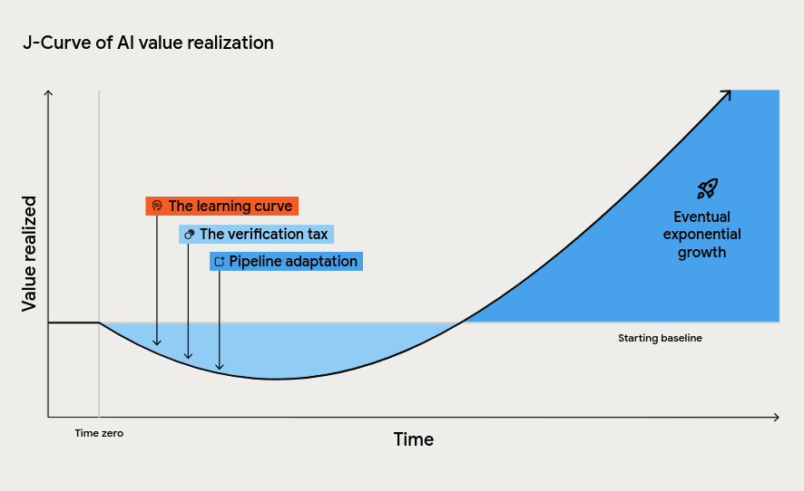
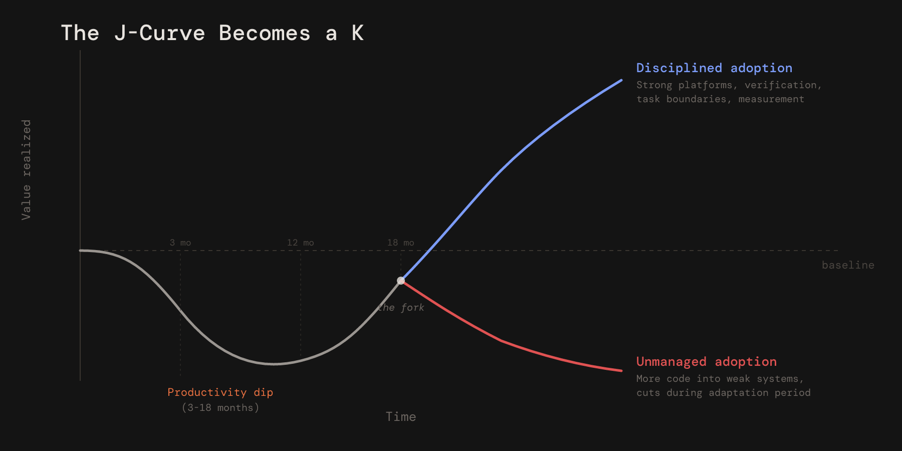

One variable in DORA's AI ROI calculator changes the story from a first-year win to a first-year loss.

Not model cost.  Not salary.  Not adoption rate.

Duration.

[DORA](https://dora.dev)'s sample model for AI-assisted software development assumes a three-month productivity dip.  On that assumption, a 500-person engineering organization produces a first-year benefit of roughly $3.3 million, a 39% ROI, and a payback period under a year.  When [Faros AI](https://www.faros.ai/blog/dora-ai-roi-calculator-telemetry-inputs) stress-tested the same calculator with a twelve-month dip instead of a three-month dip, the result inverted: the same organization went from a $3.3 million first-year gain to a $6.6 million loss.  A $9.9 million swing from one input.

That input is not a detail.  It is the model.

*DORA* is Google Cloud's *DevOps Research and Assessment* program, the research group behind the software delivery metrics many engineering organizations use to benchmark performance.  The original DORA "four keys" have now evolved into a five-metric model: change lead time, deployment frequency, failed deployment recovery time, change fail rate, and deployment rework rate.  [DORA's own guidance](https://dora.dev/guides/dora-metrics/) says these metrics measure a team's ability to deliver software safely, quickly, and efficiently, and that they predict better organizational performance and team well-being.

The 2026 DORA report on AI-assisted software development is not a hype memo.  It is a serious attempt to answer a hard management question: how should engineering leaders reason about the return on AI when the first-order effects are tangled with learning costs, verification costs, platform maturity, quality risk, and organizational redesign?  The [DORA ROI report](https://dora.dev/ai/roi/report/) proposes an ROI framework and calculator that map AI adoption through capabilities, DORA delivery metrics, and ultimately financial outcomes.  It also names the pattern many practitioners already feel: AI adoption follows a *J-curve*.  Productivity drops before it rises.

DORA's explanation for the dip is right.  Teams spend time learning new workflows.  Developers must review AI-generated code because trustworthiness is not free.  Downstream systems, review, test, security, CI/CD, and incident response, must absorb more output.  The [DORA ROI report](https://dora.dev/ai/roi/report/) calls this "the tuition cost of transformation."

The framing is useful.

The default timeline is the dangerous part.

The question is not whether AI creates a productivity dip.  The question is whether the dip lasts three months, twelve months, or long enough that leadership cuts funding, reduces headcount, or declares failure before the organization has made the complementary investments required for the upside.

DORA frames this around software development because that is the domain they study.  But the same dynamic plays out everywhere AI enters production work: business process automation, analytics pipelines, customer operations, content generation, financial modeling.  The mechanism is the same.  AI increases the volume of output before the organization has upgraded the verification, integration, and governance systems that must absorb it.  Code is the most instrumented version of this story.  It is not the only version.

That is where the J-curve becomes a fork.

## DORA is right about the mechanism

DORA's strongest idea is not the calculator.  It is the amplifier thesis.

In its [2025 State of AI-Assisted Software Development](https://dora.dev/research/2025/dora-report/) report, DORA argued that AI amplifies existing organizational conditions.  Strong engineering systems get stronger.  Weak systems get faster at producing dysfunction.  AI does not replace delivery maturity; it magnifies the presence or absence of it.

That is the right lens.

An organization with strong automated tests, fast CI, disciplined review culture, observable production systems, small-batch delivery, clean internal documentation, and a mature developer platform can absorb AI-generated output.  It has the verification surface area to handle increased volume.

An organization without those foundations gets something else: more code, larger pull requests, more review pressure, more rework, more hidden security exposure, and more incidents that appear downstream from the dashboard celebrating "AI adoption."

DORA's calculator includes this idea, but the sample assumptions understate how asymmetric the results become.  The calculator's default case shows positive ROI.  [Faros AI's stress test](https://www.faros.ai/blog/dora-ai-roi-calculator-telemetry-inputs) shows that changing the dip from three months to twelve months flips the result negative.  Faros's telemetry-informed scenario, combining longer adaptation time and quality degradation, also produces a negative first-year ROI.

That does not prove Faros is universally right.  Faros is a vendor analyzing telemetry from its own customer base, which is not the same thing as a population-representative causal study.

But it proves the management point: the ROI is highly sensitive to the duration and depth of the trough.

If leadership treats DORA's default as an expectation rather than a scenario, they will under-budget the hard part.

## The evidence does not tell one story

The empirical record on AI coding productivity is not contradictory because the researchers are incompetent.  It is contradictory because they are measuring different work under different conditions.

DORA's own 2024 data showed the tension early.  A 25% increase in AI adoption was associated with higher perceived documentation quality, code quality, and code review speed.  It was also associated with a 1.5% decrease in delivery throughput and a 7.2% decrease in delivery stability.  In other words: developers felt some things getting better while system-level delivery outcomes worsened.  See [the 2024 DORA Report](https://cloud.google.com/blog/products/devops-sre/announcing-the-2024-dora-report).

[METR](https://metr.org)'s [controlled experiment](https://metr.org/blog/2025-07-10-early-2025-ai-experienced-os-dev-study/) made that perception gap explicit.  Sixteen experienced developers completed 246 tasks in their own open-source repositories, randomly assigned to use or not use AI tools.  With AI tools, they took 19% longer.  Before the study, they expected AI to save 24% of their time.  Afterward, they still believed AI had sped them up by about 20%.

**That is the most important finding in the METR paper: not merely that AI slowed these developers down, but that the developers misread their own productivity.**

The caveat matters.  METR's sample was small, the developers were experienced, the work was complex, and the tasks were in familiar real-world codebases.  METR has also since published a [follow-up noting that a later experiment produced an unreliable estimate](https://metr.org/blog/2026-02-24-uplift-update/) because of study design and selection issues.  The slowdown result should not be treated as a universal law.

A larger field experiment by [Cui et al.](https://www.microsoft.com/en-us/research/publication/the-effects-of-generative-ai-on-high-skilled-work-evidence-from-three-field-experiments-with-software-developers/), run across Microsoft, Accenture, and an anonymous Fortune 100 company, found a very different result: a 26% increase in completed tasks among 4,867 developers using an AI coding assistant.  The effects were stronger for newer and more junior employees.

Both findings can be true.

AI helps more when the task is bounded, the context is legible, the codebase is easier to navigate, and the developer has less accumulated domain-specific advantage.  AI helps less, and can hurt, when the work requires deep local context, architectural judgment, production intuition, and careful integration into a complex codebase.

That distinction matters because most enterprise engineering is not greenfield demo work.  It is legacy systems, migrations, dependencies, security constraints, test gaps, half-documented business rules, and code nobody wants to touch.

AI is very good at producing plausible code.

The enterprise problem is verified, maintainable, production-safe change.

## The telemetry is flashing yellow

[Faros AI](https://www.faros.ai/blog/dora-ai-roi-calculator-telemetry-inputs)'s telemetry captures the shape of the tradeoff.  In its analysis of 22,000 developers across 4,000 teams, output rose sharply: task throughput per developer increased 33.7%, epics per developer increased 66.2%, and tasks associated with pull requests per team increased 210%.  But the quality and stability signals moved the other way: incidents per pull request increased 242.7%, monthly incidents increased 57.9%, and bugs per developer increased 54%.

Again, this is not causal proof that AI created every downstream issue.  It is vendor telemetry, not an RCT.

But it is directionally consistent with what engineers are reporting elsewhere: AI increases output before organizations have upgraded the verification system that must absorb that output.

The vendor telemetry that follows carries the same caveat as Faros: these companies sell code quality, security, and review tools.  They have commercial incentives to surface problems in the code their customers produce.  That does not make the data wrong, but it means the findings should be read as signal, not proof.

[Sonar](https://www.sonarsource.com)'s [2026 developer survey](https://www.sonarsource.com/resources/developer-survey-report/) found that 96% of developers do not fully trust AI-generated code, yet only 48% say they always verify AI-generated code before committing it.  Sonar also found that 53% of developers agree AI often produces code that looks correct but is not reliable.

That is the verification tax in compressed form: developers know the output is untrustworthy, but delivery pressure pushes them toward partial verification.

Security evidence points in the same direction.  [Veracode](https://www.veracode.com)'s [GenAI Code Security Report](https://www.veracode.com/blog/genai-code-security-report/) tested more than 100 large language models across common programming languages and found that 45% of generated code samples failed security tests, including OWASP Top 10 classes of weakness.  Larger and newer models did not consistently produce more secure code.

[CodeRabbit](https://www.coderabbit.ai)'s [analysis of 470 open-source pull requests](https://www.coderabbit.ai/blog/state-of-ai-vs-human-code-generation-report) found that AI-coauthored PRs contained about 1.7 times as many issues per PR as human-authored PRs, with security vulnerabilities up to 2.74 times higher.

[Apiiro](https://apiiro.com) reported that AI-assisted developers were writing three to four times more code and that AI-generated code was producing a tenfold increase in security findings, reaching 10,000 new findings per month by June 2025 across its observed repositories.  See [Apiiro's velocity and vulnerability analysis](https://apiiro.com/blog/4x-velocity-10x-vulnerabilities-ai-coding-assistants-are-shipping-more-risks/).

The pattern is not "AI code is bad."

**The pattern is "AI changes the denominator."**

When code volume rises faster than review capacity, test coverage, security scanning, architectural scrutiny, and production feedback loops, the system becomes less stable even if individual developers feel faster.

## The verification tax is not temporary

A common mistake is treating verification as an early adoption friction that will disappear once developers get used to the tools.

Some of it will.  Prompting improves.  Tooling improves.  Developers learn where AI is useful and where it is dangerous.

But the core verification tax is structural.

AI-generated code has no human intent behind it in the way a teammate's code does.  It may be syntactically clean and idiomatic while being semantically wrong.  It can pass local tests while violating an invariant that lives in a different service, a customer workflow, or an undocumented operational constraint.

That makes review harder, not easier.

The open-source world is already reacting.  *Curl* [ended its HackerOne bug bounty program](https://daniel.haxx.se/blog/2026/01/26/the-end-of-the-curl-bug-bounty/) after a flood of low-quality, AI-generated vulnerability reports overwhelmed maintainers.  *NetBSD* now [treats LLM-generated code as "tainted"](https://www.netbsd.org/developers/commit-guidelines.html) unless approved by core developers.  *Gentoo* [banned AI-generated contributions](https://www.theregister.com/2024/04/16/gentoo_linux_bans_code_contributions_written_with_ai/), citing quality, copyright, and ethical concerns.  The Linux kernel [permits AI-assisted work](https://docs.kernel.org/process/coding-assistants.html), but places full responsibility on the human submitter and requires proper disclosure and review discipline.

Those are not Luddite reactions.  They are maintenance systems defending scarce review capacity.

Enterprise engineering has the same problem, just inside the firewall.

If AI increases generation capacity by 2x but verification capacity by only 1.1x, the bottleneck moves.  The organization does not become twice as productive.  It becomes review-bound, test-bound, security-bound, and incident-bound.

That is why code volume is a dangerous success metric.

## This has happened before

The productivity dip is not unique to AI.

*Paul David*'s classic 1990 paper, ["The Dynamo and the Computer,"](https://www.jstor.org/stable/2006600) explained why electrification took decades to show up in factory productivity.  Early factories overlaid electric motors onto steam-era layouts.  They replaced the power source but kept the old organization of work.  The payoff came later, when factories were redesigned around electricity: single-story layouts, unit drives, and production flows organized around materials rather than shafts and belts.

*Brynjolfsson*, *Rock*, and *Syverson* formalized the same mechanism as the ["Productivity J-Curve."](https://www.aeaweb.org/articles?id=10.1257/mac.20180386)  General-purpose technologies such as AI require complementary investments: process redesign, new business models, human capital, organizational restructuring, and other intangible assets that are poorly measured during the investment phase.  Productivity can look flat or negative while those investments are being made, then overshoot once the new system starts compounding.

That is the economic mechanism behind DORA's J-curve.

But software leaders need to add one more observation: the J-curve does not resolve uniformly.

Some organizations invest through the trough and emerge with higher throughput, better developer experience, stronger platforms, and faster learning loops.

Others treat the trough as evidence that AI failed, or worse, use AI output as justification to cut the very people needed to verify and integrate it.

That is how the J becomes a K.

## The upper branch is not just "more AI"

The companies moving up the curve are not merely buying more licenses.  They are redesigning the delivery system around AI.

Google is the clearest high-scale example.  In Q3 2024, *Sundar Pichai* [said more than 25% of new code at Google was generated by AI](https://arstechnica.com/ai/2024/10/google-ceo-says-over-25-of-new-google-code-is-generated-by-ai/) and then reviewed by engineers.  By Cloud Next 2026, [Google said 75% of new code was AI-generated](https://blog.google/innovation-and-ai/infrastructure-and-cloud/google-cloud/cloud-next-2026-sundar-pichai/) and approved by engineers.  That is not evidence of ROI by itself, but it is evidence of a company pushing AI into the engineering workflow while preserving human review as a control point.

AWS offers a better measurement lesson.  [AWS reported a 15.9% year-over-year reduction in software development cost](https://aws.amazon.com/blogs/enterprise-strategy/business-value-of-developer-experience-improvements-amazons-15-9-breakthrough/) using its *Cost to Serve Software* framework.  The important point is not "Amazon Q saved 15.9%."  That would be too clean.  The important point is that AWS measured the whole software delivery system: deployments per builder, human interventions, incidents per deployment, and cost-to-serve.  AI was part of a broader developer-experience and operational-efficiency program, not a standalone magic line item.

*Duolingo* shows both the upside and the organizational risk.  In 2025, the company [launched 148 AI-created courses](https://techcrunch.com/2025/04/30/duolingo-launches-148-courses-created-with-ai-after-sharing-plans-to-replace-contractors-with-ai/), roughly doubling its course catalog.  That is real leverage.  But Duolingo also faced backlash over its "AI-first" posture, and CEO *Luis von Ahn* later said the company would reverse a policy tying AI usage to performance reviews after employees pushed back on using AI for its own sake.

*Shopify* is a culture case, not an outcome case.  [*Tobi Lütke*'s 2025 memo](https://techcrunch.com/2025/04/07/shopify-ceo-tells-teams-to-consider-using-ai-before-growing-headcount/) made reflexive AI usage a baseline expectation and required teams asking for more headcount or resources to show why AI could not help first.  That is a strong operating philosophy.  It is not yet a measured productivity result.

The upper branch is not "AI everywhere."

**The upper branch is disciplined adoption: strong platforms, explicit verification, clear use-case boundaries, measurement beyond code volume, and leadership willing to fund the adaptation period.**

## The lower branch is not "no AI"

The lower branch can have plenty of AI.

*Klarna* is the canonical warning.  In February 2024, [Klarna announced that its AI assistant handled 2.3 million conversations](https://www.klarna.com/international/press/klarna-ai-assistant-handles-two-thirds-of-customer-service-chats-in-its-first-month/), about two-thirds of customer-service chats, doing work equivalent to 700 full-time agents.  It also said the assistant matched human customer-satisfaction scores and was expected to drive $40 million in profit improvement.

Then the narrative changed.  By 2025, [Klarna was bringing humans back into customer service](https://www.customerexperiencedive.com/news/klarna-reinvests-human-talent-customer-service-AI-chatbot/747586/), with CEO *Sebastian Siemiatkowski* acknowledging that the company had over-indexed on cost and needed to course-correct on quality.

The lesson is not that Klarna's AI did nothing.  It clearly did something.  The lesson is that volume metrics masked quality degradation in the interactions where quality mattered most.

*Freshworks* is a different warning.  In May 2026, [Freshworks announced it would cut roughly 500 jobs](https://qz.com/freshworks-layoffs-500-jobs-ai-code-earnings-050626), about 11% of its workforce, while CEO *Dennis Woodside* said more than half of the company's code was written by AI and that automation had reduced rote work.  The company estimated restructuring charges of about $8 million.

That may prove financially rational.  It may also prove to be the exact failure mode DORA warns against: reducing human capacity during the period when AI-generated output increases the need for verification, architectural judgment, and production accountability.

The lower branch is not low adoption.

It is unmanaged adoption.

## The macro data shows concentration, not universality

The broader enterprise data supports the divergence story.

[BCG](https://www.bcg.com)'s [2025 research](https://www.bcg.com/press/30september2025-ai-leaders-outpace-laggards-revenue-growth-cost-savings) found that leading "future-built" companies are pulling away from laggards: 1.7 times the revenue growth, 3.6 times the three-year total shareholder return, and 1.6 times the EBIT margin.  BCG also found that agentic AI is accelerating the value gap, with agents accounting for 17% of total AI value in 2025 and projected to reach 29% by 2028.

[McKinsey](https://www.mckinsey.com)'s [2025 State of AI survey](https://www.mckinsey.com/capabilities/quantumblack/our-insights/the-state-of-ai) found that 88% of organizations use AI in at least one business function, but only about one-third have begun to scale AI programs.  Only about 6% qualify as AI high performers, defined as organizations attributing 5% or more EBIT impact to AI and reporting significant value.  McKinsey also found that high performers are more likely to redesign workflows, define when model outputs require human validation, and have senior leaders actively engaged in adoption.

[OECD](https://www.oecd.org) research on [emerging divides in the transition to AI](https://www.oecd.org/en/publications/emerging-divides-in-the-transition-to-artificial-intelligence_7376c776-en.html) similarly finds that AI adoption is accelerating unevenly across firms, sectors, and regions, reinforcing existing divides.  AI champions are concentrated among larger firms, innovative regions, and knowledge-intensive services, while skills shortages, cost, data protection concerns, and technology lock-in slow diffusion elsewhere.

This is the K-curve at enterprise scale.

Adoption is becoming common.

Impact is not.

## The catch-up window is open, but narrowing

The strongest objection to the K-shaped thesis is the cloud precedent.

Cloud adoption also looked divergent at first.  Late movers eventually learned from early movers, hired experienced consultants, adopted proven patterns, and caught up faster than expected.  The playbook became legible: DevOps, CI/CD, infrastructure-as-code, SRE, platform teams, FinOps.

AI adoption may follow the same path.

But there is a difference.

Cloud was primarily an infrastructure and operating-model migration.  Difficult, but codifiable.

AI-assisted software development requires a deeper form of organizational learning: trust calibration, review heuristics, task decomposition, context engineering, internal knowledge access, risk classification, human-in-the-loop design, and new quality gates.  Those capabilities can be taught, but they cannot simply be installed.

The longer a high-performing organization uses AI productively, the more it accumulates process knowledge: which tasks are safe, which are dangerous, how to review, how to instrument, how to route work, how to train juniors, how to evaluate agents, and how to distinguish code generation from software delivery.

That institutional learning compounds.

The catch-up window is not closed.  But it is not passive.

## Agents create a second J-curve

Most organizations have not finished adapting to copilots, and agents are already creating the next transition.

[McKinsey's 2025 survey](https://www.mckinsey.com/capabilities/quantumblack/our-insights/the-state-of-ai) found that 23% of organizations are scaling an agentic AI system somewhere in the enterprise, while another 39% are experimenting.  In any individual business function, no more than 10% are scaling agents.

[Gartner](https://www.gartner.com) [predicts that more than 40% of agentic AI projects will be canceled by the end of 2027](https://www.gartner.com/en/newsroom/press-releases/2025-06-25-gartner-predicts-over-40-percent-of-agentic-ai-projects-will-be-canceled-by-end-of-2027) because of escalating costs, unclear business value, or inadequate risk controls.

[S&P Global Market Intelligence](https://www.spglobal.com/market-intelligence) [found that the share of companies abandoning the majority of AI initiatives before production rose from 17% to 42% year over year](https://www.spglobal.com/market-intelligence/en/news-insights/research/ai-experiences-rapid-adoption-but-with-mixed-outcomes-highlights-from-vote-ai-machine-learning), with organizations reporting that 46% of projects are scrapped between proof of concept and broad adoption.

This is not surprising.  Agents require a different verification model than copilots.

A copilot suggests.  An agent acts.

That means the complementary investments change: permissions, audit logs, sandboxing, tool access, approval workflows, production guardrails, identity boundaries, rollback paths, and human escalation.  The verification tax does not disappear.  It moves from reviewing generated code to supervising generated action.

Organizations that built strong verification discipline during the copilot phase will move faster through the agent phase.

Organizations that skipped the discipline will start the second curve with unpaid debt from the first.

## The talent pipeline is the long fuse

The hidden cost in most AI ROI calculators is not licensing.  It is apprenticeship.

If AI handles the work junior engineers used to do, the short-term spreadsheet looks better.  Fewer entry-level hires.  Fewer simple tickets.  More senior engineers supervising generated output.

But software engineering judgment is not created by watching AI write code.  It is created by making decisions, breaking things, debugging them, getting reviewed, discovering why the obvious solution was wrong, and slowly building taste.

The labor-market evidence is early and contested, but it is concerning.  [Stanford Digital Economy Lab](https://digitaleconomy.stanford.edu)'s ["Canaries in the Coal Mine?"](https://digitaleconomy.stanford.edu/publication/canaries-in-the-coal-mine-six-facts-about-the-recent-employment-effects-of-artificial-intelligence/) study uses high-frequency administrative payroll data and finds that early-career workers aged 22 to 25 in the most AI-exposed occupations have experienced a significant relative employment decline, while more experienced workers in the same occupations have remained stable or continued to grow.  The Stanford publication reports a 16% relative decline in the latest version; SIEPR's summary of an earlier version reports 13%.

There is counter-evidence too.  [Strada](https://www.strada.org)'s [2026 employer survey](https://www.strada.org/news-insights/entry-level-hiring-in-the-ai-era-what-employers-are-thinking-and-doing) found that many employers expect AI to reshape entry-level work rather than eliminate it, increasing analytical and judgment-based responsibilities while reducing routine tasks.  In tech, the bar is rising: more judgment, fewer rote assignments.

That does not eliminate the pipeline risk.  It clarifies it.

The risk is not simply "fewer junior developers."

**The risk is fewer safe environments where junior developers can acquire the judgment senior developers need.**

An organization that replaces junior work with AI output may save money now and discover in three to five years that it has fewer engineers capable of evaluating the output.

## What engineering leaders should measure instead

Do not measure "percentage of code written by AI" as a success metric.

That is a volume metric.  It is not a delivery metric.  It can rise while quality, security, and stability fall.

Measure these instead.

*Change failure rate by code origin.* Compare AI-assisted changes with human-authored changes.  If AI-assisted changes fail materially more often, the bottleneck is verification, not adoption.

*Incident rate per pull request by code origin.* [Faros AI](https://www.faros.ai/blog/dora-ai-roi-calculator-telemetry-inputs) found incidents per PR rising sharply after AI adoption.  Your number matters more than Faros's number.  Instrument it.

*Review time and review depth by code origin.* If AI-assisted PRs wait longer, require more review cycles, or get merged with less scrutiny, you have a control problem.

*Security findings by code origin.* Static analysis, dependency scanning, secrets detection, and application security testing should be broken out by AI-assisted versus human-authored change.

*Rework and churn.* Track how often code is modified, reverted, or deleted within 30 days of merge.  [GitClear](https://www.gitclear.com)'s [work on AI-era code quality](https://www.gitclear.com/ai_assistant_code_quality_2025_research) points toward higher churn, more duplicated code, and less refactoring-associated activity as AI coding assistants spread.

*Accepted suggestion rate paired with downstream quality.* Acceptance rate alone is a usage metric.  It becomes useful only when paired with review outcomes, rework, incidents, and security findings.

*Developer trust calibration.* Teams should be able to articulate where AI is safe, where it is useful but risky, and where it is prohibited.  "We use AI for X but not Y because..." is an artifact of maturity.

## What to tell the board

Do not present DORA's 39% sample ROI as the forecast.

Present it as the optimistic case.

Then present the sensitivity case.

The board-level message should be this:

> AI-assisted development has real upside, but the return depends on funding the adaptation period.  The productivity dip is not wasted time; it is the investment phase in new verification, delivery, and operating capabilities.  Organizations that underinvest during the dip are likely to see more code, more rework, and more incidents rather than durable productivity gains.

Based on the evidence above, my working estimate is twelve to eighteen months, not three.

Months one through six are the calibration phase.  Developers learn where AI helps, where it lies, and how to review its output.  Productivity may look flat or negative if you measure verified delivery rather than code volume.

Months six through twelve are the pipeline phase.  Review, testing, security, CI/CD, observability, and incident response adapt to increased generation capacity.  Leading indicators should improve even if aggregate ROI is still mixed.

Months twelve through eighteen are the crossover phase.  If the leading indicators are improving, the organization should begin to see durable productivity gains: higher deployment frequency without higher change failure, lower lead time without more incidents, and better developer experience without quality erosion.

That is the investment thesis.

Not "AI writes code, therefore we need fewer engineers."

"AI increases generation capacity, therefore we must upgrade the delivery system."

## The first 90 days

Instrument before expanding.

Add code-origin metadata to pull requests.  Track whether changes are human-authored, AI-assisted, or agent-generated.  This does not need to be perfect on day one.  It needs to be good enough to correlate origin with review time, rework, security findings, and incidents.

Create an explicit verification owner.

Not a committee.  A person.  Their job is to watch the metrics, identify where AI-assisted work creates downstream risk, and feed that learning back into team practice.

Start with task boundaries.

AI is safer for tests, documentation, scaffolding, migrations with strong patterns, log analysis, small refactors, and local transformations.  It is riskier for authorization logic, cryptography, concurrency, financial calculations, distributed-systems behavior, data migrations, and architecture.  The list will differ by organization.  The point is to make the boundary explicit.

Measure accepted output, not generated output.

The unit of value is not a suggestion, a token, a line of code, or a generated pull request.  The unit of value is a verified change that improves the system without increasing risk.

Protect the junior rung.

Juniors should not become passive reviewers of AI output.  They need to write code, predict behavior, run experiments, debug failures, and compare their solution to the model's.  The training loop matters more than the short-term ticket velocity.

Run one calibrated pilot.

Pick one team with enough delivery maturity to produce meaningful data.  Give them tools, instrumentation, and freedom from code-volume targets.  After 90 days, compare AI-assisted and non-AI-assisted work across delivery, quality, security, and developer-experience metrics.

Then scale the operating model, not just the licenses.

## Closing: the second curve belongs to the disciplined

DORA's core insight is right: AI amplifies the system it enters.

That is why the productivity dip matters.  The dip is not just a temporary inconvenience before the inevitable payoff.  It is the period when organizations reveal whether they are capable of making the complementary investments AI requires.

Some will use AI to build stronger delivery systems.

Some will use it to ship more code into weak systems.

Some will cut people before they have upgraded verification.

Some will mistake adoption for transformation.

The tuition is real.  But tuition is not the same as graduation.

The organizations that finish the course will not be the ones that generated the most code.

They will be the ones that learned how to verify, integrate, operate, and improve at AI speed without losing the human judgment that makes the output worth anything.
