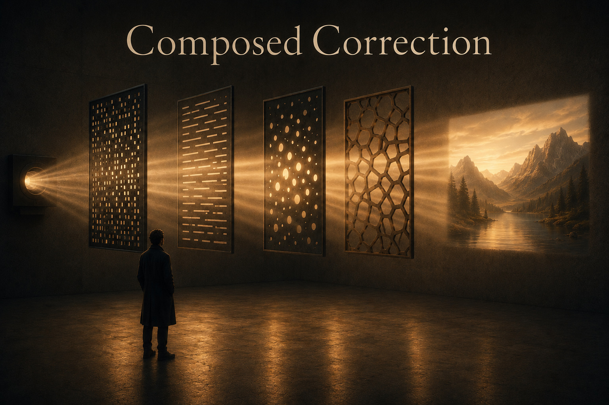

<nav class="series-nav" aria-label="Consciousness as Architecture series">

Consciousness as Architecture · a three-part series

<ol class="series-nav__list">
<li><a href="/posts/the-access-layer">The Access Layer</a></li>
<li><a href="/posts/convergent-architecture">Convergent Architecture</a></li>
<li>Composed Correction</li>
</ol>
</nav>

Two thin, biased minds that go dark in different places.  How do you put them together?

The last piece ended on that question.  The standard answer has a name.  The name is *human in the loop*.  The lazy reading of it is doing quiet damage.

## The frame that assumes the wrong thing

Picture the lazy version of "human in the loop."  A machine does the work.  A human sits above it as the check, the quality gate, the adult in the room.  Sometimes the phrase means something defensible: accountability, an escalation path, someone who can be held responsible.  But the version that's everywhere assumes something else.  It assumes the human is the *reliable* one, the fixed reference the machine gets measured against.  That's the version worth attacking.

The trouble is that the last two essays argued against exactly that assumption.  [The first piece](/posts/the-access-layer) said your own usable awareness runs on a narrow beam.  It is only a few things wide.  It never catches its own dark.  [The second](/posts/convergent-architecture) said the agent has its own narrow limit, a different one.  It gives out when you pack too much in.  Neither one is the supervisor.  Both are thin.  So what are you actually doing when you put a thin, biased mind in charge of checking another thin, biased mind?

## You can't audit what you can't perceive

The sharpest evidence here isn't philosophy.  It's a stopwatch.

*METR* ran a [randomized controlled trial](https://arxiv.org/abs/2507.09089) with sixteen experienced open-source developers doing real work on their own repositories.  Given early-2025 AI tools, they believed they were about 20 percent faster.  Measured, they were 19 percent slower.

Hold the exact figure loosely.  The authors themselves later [flagged a selection effect](https://metr.org/blog/2026-02-24-uplift-update/) that likely *overstates* the slowdown.  The task sample probably under-counted the work AI helps most with.  What survives the caveat is narrower but sturdier.  On the work they actually did, these developers couldn't feel the direction of their own error from the inside, even while living it.  That's the refrigerator light from the first piece, now with real money on it.  The task happened to be coding.  But the trap isn't specific to coding.  Any expert can be wrong about whether a tool is helping while they are in the middle of using it.

The machine has the mirror-image problem.  Asked to fix its own reasoning with [nothing new to go on](https://arxiv.org/abs/2310.01798), a model often makes things worse.  The same blind spot that produced the error is the one doing the checking.  The models that *do* reliably self-correct only learned how by being trained against an outside signal.  That is the same point wearing a lab coat.  Correction needs something the blind channel didn't already have.

So both correction stories fail alone.  And they fail the same way.  A mind can't audit the region it's blind to.  That includes the human mind.  It includes the silicon one too.  Why would stacking two instances of that failure produce reliability?

## Composition, not oversight

It doesn't.  What works instead isn't oversight in either direction.  It's composition.

Two correction systems that go dark in different places can cover for each other.  But here's the part the combine-two-opinions story quietly skips.  A human and a model are not two unrelated judges.  The model is compressed human text.  It was trained to agree with human judgment.  So it is most confidently wrong exactly where we are.  Its blind spots are correlated with yours by construction.  So the goal isn't the smartest human and the smartest model.  It's the pair of *competent* correctors whose errors line up the least.  A random checker is uncorrelated with you too.  It's also worthless.  That's portfolio thinking applied to judgment.  You diversify against correlated risk, among assets that each actually return something.  There's now a theorem shaped like this.  A 2026 [analysis of when human-AI teams beat their best member](https://arxiv.org/abs/2605.08710) proves the team helps only while the human's mistakes and the model's mistakes don't overlap too much.  Once they cross that line, no clever way of combining their answers can buy the advantage back.  Correlation isn't a tax on the gain.  Past a point, it's a wall.  And that non-overlap is never a given.  It's the thing you fight for, continuously, against a system built to line up with you.  The output was never the product.  **The question was never who's in charge.  It's whether your blind spots are composed or stacked.  Stacked is the default.**

## I built this argument that way

I didn't reason my way to that from a chair.  I built it.  I build everything the same way.

This series was drafted with the method it's describing.  Before I wrote a word, I ran the plan past two different AI models in two different setups, as adversarial reviewers.  They went dark in different places.  One caught that a theory I was leaning on had just been challenged by a major experiment.  The other caught an overclaim I'd quietly baked into the thesis.  It was a spot where I'd stated as natural fact something that was only ever a design goal.  Then I checked both of them against the primary sources before I trusted either.  A confident reviewer is still just another narrow broadcast.

Different substrates.  Different blind spots.  Arranged on purpose, with me as one more fallible node rather than the supervisor at the top.  This is one anecdote, not evidence.  But it's the whole argument in miniature.  And here's the honest part, the part that *is* the argument.  The errors most likely to survive that process are the ones all three of us shared.  That is correlation winning.  Composition narrows the dark.  It never abolishes it.  Two of my three reviewers were trained on the same internet I was.  That isn't a failure of the method.  It's the reason you keep hunting for correctors that are blind somewhere new, yourself included.

## The question that actually pays rent

I've spent three essays on the mind.  I kept expecting the interesting question to be whether the machine is like me.  It never was.  Whatever the agent is, it sometimes catches what I miss.  It sometimes misses what I catch.  Even that partial, unreliable difference is worth far more than a second copy of me would ever be.  The consciousness question was hiding a plainer one, about how to arrange fallible things so they don't all fail at once.

There's a deeper version of this argument, in its own essay: [The Loss Function Is the Product](/posts/the-loss-function-is-the-product).  It treats error-correction as the actual product you ship, and the governor you build, instead of the guardrails you bolt on.

But the practical version fits in one question.  The next time you sit down to work with an agent, don't ask how much to trust it.  Ask how correlated the two of you are.  Ask whether you did anything to lower that correlation, or just assumed you were different.  Which did you build?
