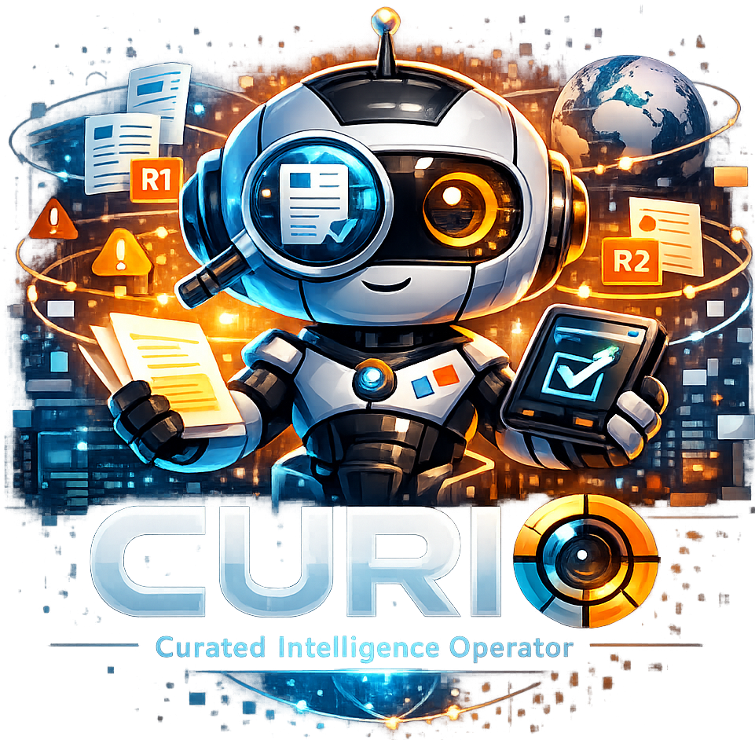

In the enterprise AI systems I work on, the hard part is rarely missing information.  It's that no shared record says which information still has authority.

The organization has information, years of it.  A Slack thread where the right answer was given once, then buried under everything posted after it.  A Confluence page that was accurate in 2022 and has been quietly wrong since.  A PDF someone important wrote, sent to a distribution list, and never opened again.  Internal tooling that three people understand and none of them documented.

Point an AI system at that knowledge and the gap shows up fast.  It retrieves the answer that was right at the time and the answer that replaced it, side by side, with nothing to say which one still holds.  The content is all there; what's missing is a maintained record of what's current, what superseded what, and which source is authoritative for a given decision.

Curio is my attempt to put that curation under version control.

---

## The missing abstraction

Many teams start by improving capture: better Confluence templates, mandatory fields in Jira, Slack integrations that auto-archive to Notion.  Those help with intake.  They don't maintain what's already there.  Once a body of material exists, the harder problem is curation: deciding what still applies, and recording that decision.

Curation is editorial work.  Raw material comes in; something with editorial judgment reviews it, places it in the right structural context, assigns it a status, and connects it to related material.  Editorial teams have long done this by hand.  What organizations need is the same function running continuously, with people reviewing and approving the changes that carry real risk rather than doing all of it themselves.

Curio is that infrastructure: a curation system where the source of truth is a Git repository, agents drive the editorial judgment, and the published surface is a Confluence space you never edit directly.

---

## How it works

The core pipeline has four stages:

*Intake.*  You feed Curio a source, a URL, a Confluence page tree, a local file, a Slack export.  The content is extracted to markdown and written to `wiki/intake/` with full provenance metadata in YAML frontmatter: source URL, ingestion timestamp, content hash, source kind.  At this stage, nothing has been judged yet.

*Processing.*  Processing runs in two deliberate phases, so the model's output can be inspected and validated before it changes the tree.

*Phase 1, Prepare:* `curio process --prepare` reads all intake pages and produces a JSON routing manifest.  This manifest describes what the agent needs to reason about: the existing taxonomy, the new material, the open questions about hierarchical placement.  The agent ([Claude](https://anthropic.com/claude), [Gemini](https://deepmind.google/technologies/gemini/), or [Codex](https://openai.com/codex), your choice) receives this manifest along with the knowledge base's `NORTHSTAR.md` charter, which defines the taxonomic structure and curation intent.

*Phase 2, Apply:* The agent returns routing decisions.  Curio's CLI applies them atomically: `curio process --route-file decisions.json`.  Each page moves to `staged/{category}/` or `review/{category}/`, receives confidence scoring, and gets a `.analysis.json` sidecar with the full reasoning trace.

There are no LLM calls in the Rust binary.  The deterministic substrate handles file operations, validation, and Git commits; the agent only proposes the editorial decisions.  The two have different failure modes, so they sit on opposite sides of a hard interface: the binary never reasons, and the agent never touches the filesystem.

*Review and publish.*  Pages above a confidence threshold go to `staged/`.  Pages where the agent flagged ambiguity, low confidence score, taxonomy conflict, unusual source, go to `review/` for human inspection.  Confluence surfaces the review queue directly; reviewers work where they already work, and approvals push changes back through the pipeline.  `curio publish` promotes staged pages to `published/` with updated cross-reference indexes.

*Sync.*  `curio sync` pushes the published tree to Confluence as a one-way mirror.  The Git repository is always the source of truth.  Confluence is never edited directly; it's a curated, structured publication surface for the people who don't live in terminals.

---

## The architecture decisions

A few choices shaped the design more than anything else.

*Git as the system of record.*  Every curation decision is a commit.  Every routing change is auditable.  You can diff the knowledge base across time, branch for experimental curation passes, and roll back a bad healing run.  Git brings to institutional knowledge what it already brought to code: version control and a full audit trail.

*Hierarchy as the optimization target.*  Curio treats hierarchy as part of the routing decision, not just placement.  Placement asks whether a page lands in roughly the right bucket.  Hierarchy asks whether it belongs exactly where it is, at the right depth, with the right parent, next to the right peers.  The agent is prompted to consider restructuring existing material, not only slotting the new page into a bucket.  Good content is still hard to use when its hierarchy is incoherent.

*Quality as a first-class property.*  Every page carries a freshness score (days since meaningful update, against a configurable threshold), an overlap score (semantic similarity against peers in the same subtree), and a signal quality assessment (content depth, keyword richness, external references).  `curio doctor` runs these across the whole knowledge base and surfaces the drift before it accumulates.  `curio heal` proposes consolidations for overlapping content; confidence-gated automatic healing runs the low-risk ones without human review.

*Provider agnosticism.*  [Claude](https://anthropic.com/claude), [Gemini](https://deepmind.google/technologies/gemini/), and [Codex](https://openai.com/codex) all launch from the same harness contract.  The same environment variables, the same entry points, the same CLI output format.  Switching models is an operator decision, not a code change.  This matters in practice because the right model for bulk intake routing isn't necessarily the right model for nuanced taxonomy restructuring, and you want the flexibility to use both without rebuilding the system.

---

## The service layer

The CLI is the foundation, but the real deployment target is a containerized service that wraps it.  The service handles multi-workspace registration (separate knowledge bases for different teams or use cases), asynchronous job execution, a per-workspace audit stream, and a Git materializer that clones repositories to local mirrors and creates isolated worktrees for concurrent curation jobs.

This is the layer for running more than one knowledge base: one instance, multiple workspaces, per-job history, and isolated worktrees so concurrent jobs don't collide on the same checkout.

---

## What this says about enterprise AI

In a lot of the enterprise AI I've worked on, knowledge was an afterthought.  Retrieval got bolted on at the end, and the vector store was populated with whatever was easiest to export.

Curio reflects a different premise: **knowledge management is infrastructure.**  It needs the same engineering rigor you'd apply to any other production system: defined interfaces, durable state, quality gates, observability, and a clear operational model.  The agent layer provides editorial judgment at scale; the infrastructure layer ensures that judgment is applied consistently, auditably, and reversibly.

The code is on [GitHub](https://github.com/RyanMerlin/curio).  If you're building production AI systems and hitting the knowledge wall, I'd be interested in what you're seeing.

---

*Curio is written in Rust.  The deterministic CLI substrate is open source.  The agent harness is provider-agnostic: [Claude](https://anthropic.com/claude), [Gemini](https://deepmind.google/technologies/gemini/), and [Codex](https://openai.com/codex) all work from the same contract.  Longer discussion in the repo's `docs/design/` folder.*
