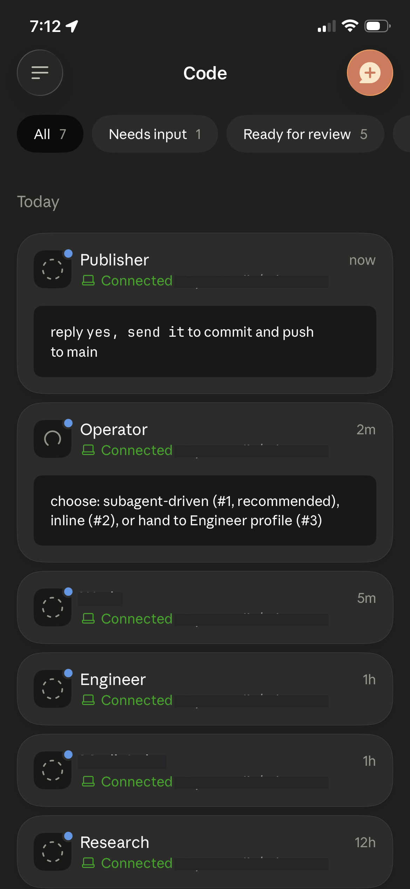
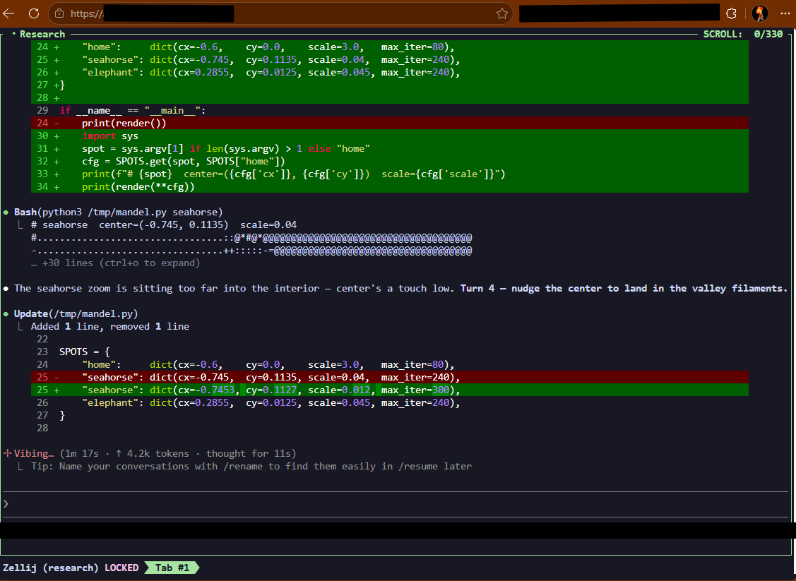

This morning I started a refactor on one of my agents, left the house, and approved the result from my phone while walking the dog.  The work ran on the machine at home the whole time.  What I reached from the sidewalk was not a fresh chat rebuilding context from scratch, but the same live session, still going, seen through a different window.

Why do we still treat an agent session like a browser tab, bound to the device and the moment we opened it, when the work underneath is a long-lived process with no reason to care where we are standing?

The unit that matters is [the session, not the request](/posts/persistent-sessions-unit-of-agent-work), and definitely not the device.  Once that clicks, the rest is plumbing.  It comes in five layers: a persistent session, the agent inside it, a way to reach one agent, a way to reach the whole fleet, and the tunnel that exposes all of it without opening your house to the internet.  Here is the rig I actually run.

## Layer 1: a persistent session per agent

My fleet is six agents, one per role: operator, engineer, research, work, publisher, and a homelab profile.  Each runs as a named [*Zellij*](https://zellij.dev) session.  Zellij is a terminal multiplexer, so a session is a persistent, named, resumable workspace that survives detach, disconnect, and the laptop lid closing.

A systemd user service owns each session and keeps it alive.  The unit is mostly boilerplate, with one line that earns its place:

```ini
# ~/.config/systemd/user/agent-publisher.service
[Unit]
Description=Publisher agent (Zellij session)
After=network-online.target zellij-web.service
Wants=network-online.target
# Crash-loop guard: trip to failed after a burst instead of restarting forever
StartLimitIntervalSec=600
StartLimitBurst=10

[Service]
Type=simple
WorkingDirectory=%h/agents/publisher
Environment=TERM=xterm-256color
# Clear any stale session left by a previous run before starting
ExecStartPre=/bin/sh -c 'zellij delete-session publisher --force 2>/dev/null; true'
# The line that matters: `script` hands Zellij a PTY so it runs headless under systemd
ExecStart=/bin/sh -c 'exec script -q -c "stty rows 50 cols 220; exec zellij --session publisher -n publisher" /dev/null'
ExecStop=/bin/sh -c 'zellij kill-session publisher --force 2>/dev/null; true'
Restart=always
RestartSec=5

[Install]
WantedBy=default.target
```

The non-obvious part is `ExecStart`.  Zellij wants a terminal and systemd does not hand it one, so the service wraps it in [`script`](https://man7.org/linux/man-pages/man1/script.1.html), which allocates a pseudo-terminal and lets Zellij run headless.  Without that wrapper the unit dies on startup complaining there is no TTY, and the `stty rows 50 cols 220` in front of it just gives that headless terminal a sane size instead of an 80x24 default.  The crash-loop guard trips the unit to `failed` after ten restarts in ten minutes, so a session that is genuinely broken stops thrashing instead of pretending it will recover.

The `-n publisher` flag loads a layout, and the layout is where the agent actually starts.

## Layer 2: the agent inside the session

A Zellij layout is a small declarative file describing the panes.  Mine has one pane that matters, and it runs a launcher script:

```kdl
// ~/.config/zellij/layouts/publisher.kdl
layout {
    pane command="./launch.sh" cwd="~/agents/publisher"
}
```

The launcher is where persistence stops being theoretical.  Claude Code, like any process, can exit: a crash, an out-of-memory kill, a model timeout.  If the agent is supposed to be something I attach to tomorrow, it cannot quietly die today.  So the launcher runs it in a self-healing loop that backs off when restarts come too fast:

```bash
#!/bin/bash
# launch.sh: restart Claude Code on exit, widen the delay on quick crashes
MIN=5; MAX=60; QUICK=120; delay=$MIN
while true; do
    start=$(date +%s)

    claude --model claude-opus-4-8 --effort high \
        --name "Publisher" --remote-control

    # A fast exit means something is wrong; widen the backoff
    if (( $(date +%s) - start < QUICK )); then
        delay=$(( delay*2 > MAX ? MAX : delay*2 ))
    else
        delay=$MIN
    fi
    sleep $delay
done
```

Two flags carry the whole "from anywhere" story.  `--name` gives the session a stable identity, so it shows up as *Publisher* and not a random hash.  `--remote-control` is the one that reaches your pocket, and it earns its own layer.

## Layer 3: reaching one agent through the Claude apps

Claude Code ships a feature called [*Remote Control*](https://code.claude.com/docs/en/remote-control), a research preview as of early 2026, that connects a session running on your own machine to the Claude desktop app, the mobile app, and the browser at claude.ai/code.  The session stays on your box.  The app is a relay and a control surface, nothing more: it forwards your input to the agent you are already running and streams the output back over an outbound connection, so you never open a port at home.

Because the launcher passes `--remote-control` on every start, the agent registers with the apps whenever it is up, and the restart loop means it is almost always up.  The constraint in the docs is real and worth stating plainly: if the local process dies, that Remote Control session ends with it, and a network outage of roughly ten minutes will time it out as well.  The restart loop does not make any of that immortal.  What it buys me is supervision rather than resurrection: the named agent comes back on its own, re-registers, and is reachable again from the same surfaces without me opening an SSH session to the box.  That is a weaker promise than "the session never dies," and it is the one I can actually keep.

There is a cloud-hosted sibling, [Claude Code on the web](https://code.claude.com/docs/en/claude-code-on-the-web), where the session runs on Anthropic's infrastructure instead of yours.  That is the right tool when you want to start work with no local setup.  It is the wrong tool here, because the entire premise is that my agents live next to my files, my secrets, and my homelab, on hardware I control.  Remote Control lets me keep all of that and still drive one agent, with full attention, from a phone.



*This is the view I actually live in.  Every agent in the fleet shows up in the Claude app's Code tab, each one a live session running on the box at home, and the green "Connected" line means I can open it and steer it from wherever I happen to be standing.*

## Layer 4: reaching the whole fleet through zellij web

Remote Control gives me one agent at a time.  Some mornings I want the switchboard instead: every agent in one place, a glance across all of them, drop into whichever one has something to say.  That is the browser path.

[*zellij web*](https://zellij.dev) runs a small web server that serves the terminal sessions over HTTP and gives you a TUI to move between them.  It is one server for the whole fleet, not one per agent, so it gets its own unit, the `zellij-web.service` the agent units order themselves after:

```ini
# ~/.config/systemd/user/zellij-web.service
[Service]
Type=simple
ExecStart=/bin/sh -c 'exec zellij web --start --ip 127.0.0.1 --port 8082'
Restart=on-failure
RestartSec=5
```

Auth is a login token, which Zellij prints exactly once and cannot show again, so save it where you keep secrets:

```
zellij web --create-token --token-name phone
```

Inside the browser I navigate the fleet the same way I do at the desk.  A small Zellij plugin gives me a dashboard and single-key jumps between profiles, and `mirror_session true` in the config lets two clients, say a laptop and a phone, attach to the same session and both resize correctly.  One sharp edge is worth knowing before it frustrates you: the browser terminal (xterm.js) swallows a bare Escape key, which Claude Code leans on, so I bind a spare chord to send a literal Escape byte through instead.  A small thing, and exactly the kind of small thing that separates a demo from something you actually use on the move.



*The browser path: `zellij web` serving a session, with the research agent mid-task in its own pane, iterating on a throwaway Mandelbrot renderer.  Same fleet as the phone view, different window, and the switcher lets me jump between agents without leaving the tab.*

So how do you reach a server bound to localhost from a coffee shop without turning your home network into an open door?

## Layer 5: exposing it safely, and the gotcha that bites everyone

The web server listens on `127.0.0.1` on purpose.  Nothing here should be reachable just because it happens to be running.  Getting to it from outside has two honest shapes, and they differ in whether anything becomes public at all.

The first is a private mesh.  [Tailscale](https://tailscale.com) puts the box and my phone on the same virtual network, so the phone reaches the machine by its tailnet address or MagicDNS name, not by a public hostname and not across the open internet.  The web server still binds to localhost on the box; Tailscale just gives my other devices a private path to it, and [Tailscale Serve](https://tailscale.com/kb/1312/serve) will publish that local port inside the tailnet if I want a tidy URL for it.  For a single operator this is the simplest and safest answer, because a device is either a member of the tailnet or it cannot see the terminal at all, and that membership is the authentication.  [Funnel](https://tailscale.com/kb/1223/funnel) exists if you ever want to expose a service to the public internet, but the appeal of the mesh is that you usually do not.

The second is a public tunnel, for when you want a real URL that works from any browser with nothing installed.  [Cloudflare Tunnel](https://developers.cloudflare.com/cloudflare-one/connections/connect-networks/) runs a small agent on the box that dials out to the edge, and the edge routes a public hostname back down that outbound connection, so there is still no inbound port on my network.  The ingress is one line of intent, a hostname mapped to a local address:

```yaml
# the shape, not my real hostnames
ingress:
  - hostname: agents.example.com
    service: http://127.0.0.1:8083
  - service: http_status:404
```

A public URL is reachable, but reachable is not safe, and a login token is a single factor in front of a shell that can run anything.  So ahead of the hostname I put an identity-aware access layer that authenticates every request against an identity provider before it reaches Zellij.  I use Cloudflare Access with [Authentik](https://goauthentik.io) as the identity provider, so a new device meets an SSO login with MFA, not a terminal prompt.  This is the work the mesh does for free: on a tailnet, identity is the network; on a public tunnel, you add that gate yourself.  Either way, never let the multiplexer's own token be the only thing standing between the internet and arbitrary command execution.

Now the gotcha, and it is specific to the public-edge path.  Notice the ingress points at `:8083`, not the `:8082` where Zellij actually listens.  The browser client holds a long-lived WebSocket, and an edge proxy will quietly drop a WebSocket it decides has gone idle.  [Cloudflare documents exactly this](https://developers.cloudflare.com/network/websockets/) and recommends heartbeat traffic for long-lived connections; on my free-tier path the cutoff landed at roughly a couple of minutes of silence.  An agent thinking quietly for that long looks exactly that idle, and your terminal goes dead mid-thought.  The fix is a tiny proxy between the tunnel and Zellij, forwarding all traffic untouched but injecting a protocol-level ping every thirty seconds so the edge sees activity and holds the line open:

```
phone → edge → tunnel → 127.0.0.1:8083 (keepalive) → 127.0.0.1:8082 (zellij web)
```

It is about a hundred lines, runs as its own service, and is the single piece in this whole stack that is not close to copy-paste.  A private mesh skips it entirely, since there is no idle-dropping edge in the path, which is one more reason to reach for Tailscale first and the public tunnel only when you actually need a public URL.

## Where it breaks

No rig is honest without its failure modes, so here are the ones I have actually hit and what catches each:

| What fails | What you see | What catches it |
|---|---|---|
| The laptop sleeps | the window goes away, the work does not | the agent runs on an always-on box, never the laptop |
| Claude Code exits | the Remote Control session ends with it | the launcher loop and systemd bring the named agent back |
| Zellij dies | the session is gone, not paused | systemd restarts the unit fresh; serialization is off, so nothing stale pretends to resume |
| A public WebSocket idles | the browser terminal freezes mid-thought | the keepalive proxy, on the public-edge path only |
| A token leaks | someone has a shell, not "an app" | the SSO and MFA gate in front of it, and revoke the token |
| The agent does something dumb | it can touch whatever your shell can touch | least-privilege secrets, scoped permissions, and a human still in the approval loop |

## Why not just SSH?

The obvious objection is that I already have SSH, and SSH would reach the box too.  True, and SSH is still the break-glass path when everything else is on fire.  It is just not the experience I want for steering an agent from a phone at a crosswalk: no native approval prompts, no fleet switchboard, and a thumb-sized keyboard wrestling a full terminal.  Remote Control gives me the Claude-native approval loop for one agent, zellij web gives me the switchboard for all of them, and SSH stays exactly where it belongs, behind glass with a small hammer next to it.

## What this is not

This is a rig for one operator who controls a machine, not a product.  It is not multi-tenant: there is no per-user isolation, no team permissions, no audit surface beyond what systemd and your shell history already give you.  It is not the right tool for ephemeral, stateless tasks that a fresh hosted session would handle just as well, and it is not a substitute for real orchestration and observability once you are running enough agents that "attach and look" stops being a strategy.  The whole design assumes the opposite of those cases: a small number of long-lived agents, on hardware you own, that you personally want to reach.  If that is not your situation, most of this is overhead you do not need.

## The point underneath the setup

Five layers, one idea, and it is the takeaway: **an agent should be reachable, not ephemeral.**  Remote Control gives me one agent in sharp focus.  zellij web gives me the whole fleet at a glance.  The tunnel and the keepalive make both of them reachable from a sidewalk.  None of them is the agent.  The agent is the session on the box, supervised by systemd, restarted on death, accumulating context and doing work, and every device I pick up is just another window onto it.

That reframing changes how the day feels.  I am not reopening conversations and hoping the context survived.  I start work, walk away, and the question on my phone is never "where was I."  It is "what is it doing right now, and do I want to change it?"

If your agents already run as long-lived processes, you are most of the way there.  Everything above is just deciding which window you want to open, and from how far away.
