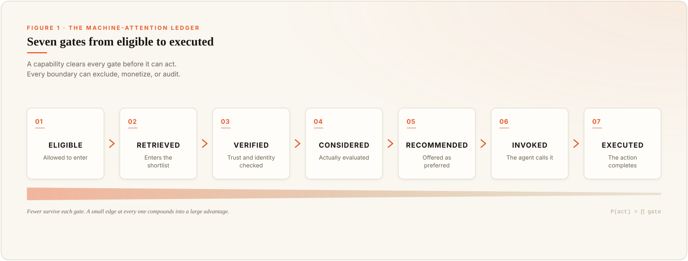
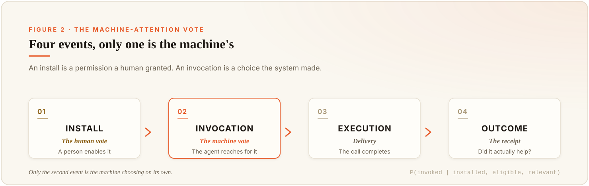

Over the last thirty years, the commercial internet has industrialized the fight for human attention. Sometimes companies buy it with ad budgets and prime pixels. Sometimes they earn it through search rankings, reputation, word of mouth, and the perfect headline. Both routes aim at the same target: a human nervous system that feels social proof, fears missing out, trusts a familiar name, and follows a crowd.

The next fight is already under way, and it's stranger, because the buyer you now have to win over has no eyes.  The old signals can still matter, but the nervous system they were built to move is gone.  When an AI agent books the trip, picks the vendor, or assembles the software stack, it narrows the field to a few trusted options and drops the rest before any human sees a screen.

I build the systems where that choice gets made.  After watching it happen a few thousand times, I can tell you it looks a lot like the old attention economy, moved to a room the customer never enters.

That old economy turned notice into traffic, traffic into data, and data into money.  AI agents are opening a second attention economy upstream of the first.  It begins before a person sees any options at all.

The first exchanges in this new economy don't look like ad exchanges.  They look like plugin directories.

Every enterprise buyer already knows this shape from procurement.  Purchasing keeps an *approved-vendor list*.  You can be the cheapest, most reliable supplier in your category, and if you're not on that list, the buyer can't cut you a purchase order.  *The list decides who's allowed to be considered, long before anyone compares prices.*

An AI agent keeps a list like that too, for tools and data sources and counterparties.  This one updates itself, and nobody publishes it.

So here's the bet this piece is making.  **The scarce thing in an agent economy isn't notice.  It’s admission to the set an agent is willing and authorized to consider.**  Admission is becoming rankable. The next question is whether it becomes ownable, then sellable. Plugin directories are the first visible exchanges, even if the real value ultimately sits deeper in the stack.

<section class="argument-brief" aria-labelledby="argument-brief-title">

The argument in brief

<ol class="argument-brief__list">
<li>**Scarcity:** AI agents create a new allocation layer between supply and human demand.  The scarce position is no longer visibility alone, but admission into the set an agent is willing and authorized to consider.</li>
<li>**Conversion:** The economically important transitions are not listing or mention, but eligibility, retrieval, verification, recommendation, invocation, execution, and measured outcome.</li>
<li>**Compounding:** Repeated machine selection leaves residue.  Successful tools become easier to retrieve, trust, authorize, and select again, creating a form of compounding attention capital.</li>
<li>**Correlation:** Apparent agreement across many agents may reflect shared models, registries, indexes, defaults, or infrastructure rather than genuinely independent judgment.</li>
<li>**Control:** Market power will increasingly belong to whoever controls candidate sets, permissions, defaults, and the evidence agents use to justify action.</li>
</ol>
</section>

## Part I: The New Scarcity

### What am I actually calling attention here?

Let me kill the ambiguity before the word runs away from us, because it points at four different things and only one of them is the subject.

I don't mean the *attention* mechanism inside a transformer, the math that lets a model weigh some tokens more than others.  I don't mean a machine having an inner experience.  I don't mean the physicist's observer.  I mean attention in the plain economic sense the field has used since *Herbert Simon*, the sense in which a scarce resource gets *allocated*.

Call it *allocative machine attention*: the bounded consideration an AI system spreads across competing sources, tools, and counterparties when that choice changes what gets represented or acted on.

The definition earns its keep through three words.  *Bounded* means the system can't evaluate everything at equal depth, because it runs out of tokens, retrieval slots, latency budget, money, or human patience first.  *Competing* means one option gets an opening another doesn't.  *Changes representation or action* means the choice leaves a mark, something gets surfaced, invoked, purchased, routed, or quietly dropped.

Does the machine need to be conscious for any of this?  No, and that's the point that trips people up.  A compiler rejects your program without feelings about it.  A credit system denies a loan without wanting to.  An agent drops a vendor from the candidate set without caring who wins.  The property that matters isn't experience.  It's *delegated discretion under constraint*.  Give a system a budget and permission to act, and it's already allocating attention whether or not anyone's home.

### Haven't people already seen this?

They've seen the neighborhood.  The honest version of the claim has to concede that first.

*Simon* named the core trade more than fifty years ago: [information consumes attention](https://gwern.net/doc/design/1971-simon.pdf), so an abundance of information manufactures a scarcity of whatever has to process it.  Economists later turned limited processing into a formal variable under [rational inattention](https://www.sciencedirect.com/science/article/pii/S0304393203000291).  Platform scholars showed how digital intermediaries collect [algorithmic attention rents](https://www.cambridge.org/core/journals/data-and-policy/article/algorithmic-attention-rents-a-theory-of-digital-platform-market-power/D85FE41F6CF99FC57DDFB2B2B63491C5) by controlling which suppliers reach human eyes.  And the machine-facing pieces are landing fast: [Generative Engine Optimization](https://arxiv.org/abs/2311.09735) studies how sources fight to appear inside generated answers, controlled-shopping work like [ACES](https://arxiv.org/abs/2508.02630) shows AI buyers have measurable, gameable position biases, and economists are already modeling an [economy of AI agents](https://www.nber.org/books-and-chapters/economics-transformative-ai/economy-ai-agents) and the [transaction costs](https://www.nber.org/papers/w34468) agents might collapse or create.

So if the argument were only "companies will optimize for bots," you should close the tab.  That argument already shipped.

The narrower claim is the one worth your time.  Retrieval, citation, recommendation, tool selection, permission, and execution are not six separate AI curiosities.  They're successive gates in one market, the market for turning machine consideration into economic action.  The pieces are already visible. The missing move is to treat them as one exchange, with one scarce good moving through it: machine consideration capable of becoming economic action.

### Doesn't a bigger context window just make this go away?

That's the reflex, and it's wrong in an instructive way.

The old attention economy was organized around the screen, around what a person could notice, click, and remember.  An agent moves the bottleneck upstream, to the moment before anyone sees a recommendation.  By then the system may already have decided which registries it trusts, which plugins are enabled for your role, which tools fit inside its budget, which sources are even retrievable, which claims are cheap enough to verify, and which actions it's allowed to take at all.

> The answer you read is the visible edge of a much larger exclusion you don't.

A bigger context window doesn't dissolve that.  It moves it.  Make retrieval cheap and verification becomes the scarce step.  Make verification cheap and authorization becomes scarce.  An agent can generate a thousand recommendations, and the company can still sign exactly one contract.  I made the narrow version of this case in [The MCP Explosion Has a Scaling Problem](/posts/mcp-explosion-scaling-problem): every tool you add carries a discovery and selection cost, so an expanding catalog turns choosing into an architecture problem.  The broader shape holds everywhere.  *Scarcity lives wherever the system still has to exclude*, and it always has to exclude somewhere.  The machine reads faster than you.  It still can't load, verify, and safely act through the entire world.  And a bigger window doesn't even guarantee a better pick.  One 2026 study, [Looking Is Not Picking](https://arxiv.org/abs/2606.16364), found that the tested agents often attend to the right tool and still choose wrong, because the bottleneck sits in the decision itself, not the size of the menu.

## Part II: From Consideration to Action

### Where does the money actually live?

A mention is not a market outcome.  A skill can rank first and never get installed, get installed and never invoked, get invoked and fail, and even succeed while making the user worse off.  So the market can't be measured at any single point.  It lives in a ledger that follows the decision all the way through.

Read it as the path from approved-vendor list to delivered goods.  Each gate asks a different question, and each has a different owner.

| Gate | The question it answers | Who controls it |
|---|---|---|
| Eligible | Can this thing participate at all? | Admin, platform, policy, registry |
| Retrieved | Does it enter the candidate set for this task? | Search, retriever, marketplace ranking |
| Verified | Can its identity and claims be checked cheaply? | Trust service, security layer |
| Considered | Does it get real evaluation, not a glance? | Model, router, planner |
| Recommended | Is it offered as the preferred option? | Agent, interface |
| Invoked | Does the system actually reach for it? | Agent runtime, permission layer |
| Executed | Does the operation complete and matter? | Tool, vendor, transaction layer |

The ladder stops at execution, but the economic story does not. Outcome arrives after the machine is done. Did the completed operation actually help, at acceptable cost and risk?  A tool can execute flawlessly and still leave the user worse off, which is why execution is delivery, not value.  And the ladder itself is a measurement simplification, not a fixed architecture.  Real systems branch, retry, check some gates continuously, and skip others entirely, and a person sometimes reaches past all of them to pick a tool directly.  Recommendation especially is an optional detour, since an agent can invoke a tool without ever showing it to a person.  For the direct action path, though, the gates still multiply.  A supplier's real odds of getting used are `P(eligible) x P(retrieved | eligible) x P(verified | retrieved) x ... x P(executed | invoked)`, each gate conditional on clearing the one before.

Why does that framing matter?  Because small edges compound into large ones.  A supplier that's twenty percent more likely to clear each of six gates is almost three times as likely to reach execution, since 1.2 to the sixth power is about 3, even if it never looked dramatically better at any single step.  The reverse bites just as hard.  A company can dominate generated mentions and still capture almost no economic action, because it dies at authentication, or permission, or runtime reliability.  **Representation isn't allocation.  Recommendation isn't authorization.  Invocation isn't success.  The market is made in the transitions between those words, not in any one of them.**

### What counts as the machine's vote?

Here's the easy mistake, and I've caught myself making it.  Calling an install "machine attention."  Usually it isn't.  A person browsed a directory, a developer copied a command, an admin enabled a plugin.  The marketplace may have nudged that choice, but the adoption event was still human.  That's *human attention wearing a machine's clothes*.

Machine attention starts one step later, when the enabled system faces a real task and allocates work among the tools it's allowed to use.  Which gives you a clean way to read the numbers.

So the metric that may matter most in this whole field is `P(invoked | installed, eligible, and relevant)`, the rate at which human permission converts into the agent's own choice.  The version that really counts is the agent-initiated invocation, since a person can also fire a tool by hand, and only the machine picking on its own is the machine's vote.  A capability with a million installs and almost no relevant invocations is a fashionable shelf ornament.  A capability with modest installs and dominant task-level invocation is infrastructure.  The directory can't tell those two apart.  The runtime can.

### Where can you watch this happening right now?

The emerging skill and plugin ecosystems make the funnel measurable sooner than I expected. They’re not identical, and most aren’t yet money markets in the ordinary sense. Some are registries, some directories, some enterprise control planes. But market logic begins as soon as suppliers compete for scarce allocation under a set of rules. Money can arrive later.

*Product details in this section are current as of July 17, 2026. These surfaces move weekly, so hold onto the distinctions, not the counts.*

[ClawHub.](https://docs.openclaw.ai/clawhub) An open discovery surface with public read APIs for search and packages.  Its [ranking](https://docs.openclaw.ai/clawhub/http-api) blends semantic relevance, exact-name boosts, a capped popularity prior, and moderation state. That is already a machine-attention function: it determines what is discoverable and when trust overrides popularity.  But its [install telemetry](https://docs.openclaw.ai/clawhub/telemetry) is aggregate and optional. It shows reported adoption, not whether an agent reached for the skill when it mattered.

[Claude.](https://code.claude.com/docs/en/discover-plugins) Its [organization analytics](https://platform.claude.com/docs/en/api/admin/analytics/plugins/list) separate installs from invocations. That gap is the thesis in miniature: installation is human permission; invocation is machine allocation during real work.

[OpenAI.](https://help.openai.com/en/articles/20001256-plugins-in-chatgpt-and-codex) It turns eligibility into an administrative primitive. Workspace admins can make a plugin *Available* or *Install* it by default for a role, while app permissions separately govern access to underlying data. The valuable position is no longer simply the top of a screen. It is quiet inclusion in the role’s default toolset.

[Smithery.](https://smithery.ai/docs/build) Exposes tool calls, a closer proxy for machine selection than installs, though not proof of a good outcome. A call might still be an error or retry.

[Skills.sh.](https://www.skills.sh/docs) ranks reusable skills across Claude Code, Cursor, Codex, Gemini, and more, which makes it a lens on cross-agent diffusion, though its telemetry still tracks what entered the toolbox, not what the worker picked up.  

[MCP Registry.](https://modelcontextprotocol.io/registry/about) It contributes identity and provenance rather than behavioral telemetry. Its identifiers can help reveal whether several storefront listings represent independent competitors or one repository wearing several labels.

Line them up and the pattern is the same everywhere.  Each surface shows part of the funnel and hides the part that would let you grade it.

| Surface | What you can see | The blind spot |
|---|---|---|
| ClawHub | Rank, relevance signals, installs, security state | Runtime invocation and outcome |
| Claude plugins | Org-level installs and invocations (analytics API) | Public outcome quality and value |
| OpenAI Directory | Membership, role policy, availability, defaults | Comparable public usage telemetry |
| Smithery | Discovery, tool calls, usage patterns | Task intent, counterfactual choice, welfare |
| Skills.sh | Cross-agent installs and popularity movement | Invocation and execution |
| MCP Registry | Identity, packages, capabilities, provenance | Discovery share and behavior |

The counts don't even mean the same thing across columns, since one platform's install is a unique person and another's is a CLI event.  But together they show where the ecosystem has started to instrument the funnel, and where the numbers that would matter most are still missing.  You can watch supply, discovery, adoption, eligibility, invocation, and a little execution.  Whether that already adds up to a market is precisely what's unsettled.  The missing work is connecting them into one line.

## Part III: Attention Becomes Capital

### What does attention do to the thing it lands on?

**Attention doesn't create complexity.  It decides where complexity accumulates.**

Here's the idea that actually started this for me, and it's less about economics than it looks.  The naive version is that complexity and attention are two sides of one coin.  That's not quite right, because a rock doesn't get more intricate just because people stare at it.  The real mechanism is that attention chooses *where* complexity piles up.

For whoever's doing the looking, attention reduces complexity.  It narrows an impossible field down to the small slice that can actually be represented and used.  That's true in your own head, where a tiny access layer selects from a vast background you never consciously touch, and I wrote about that cognitive version in [The Access Layer](/posts/the-access-layer).  It's just as true in an agent, where retrieval and tool discovery pull a small working set out of a huge external world.

But for an adaptive thing on the receiving end, the direction flips.  A capability that keeps getting selected piles up users, logs, reviews, revenue, integrations, documentation, and fixes.  Every one of those makes it easier to select the next time.

*The observer sees less.  The observed grows more machinery around being seen.*

That reversal only fires under one condition.  The surrounding system has to remember, adapt, and feed the result back.  Attention without memory is just exposure.  Attention with memory and feedback becomes structure.  Here's the line I keep coming back to.

> Attention compresses for the observer and compounds for the observed.

Hold onto that second half, because the economics of every agent marketplace is that half made literal.

### What happens after a capability gets picked?

If the system has memory, the pick leaves a residue, and the residue is where this stops being a curiosity and starts being capital.

A temporary boost can produce installs. Some installs become invocations. Successful invocations create logs, reviews, examples, integrations, revenue, and operational familiarity.  Every one of those lowers the cost of choosing the same capability next time.  The platform grows more confident, admins approve it more widely, publishers keep improving it, and more agents meet it as the established option.  The original boost can vanish while the advantage stays.  Call that residue *attention capital*: the assets left by prior machine selection that raise the odds of future selection.

The loop isn't automatically bad, and I want to be fair to it.  A reliable tool *should* build a track record, and a repeatedly-successful supplier *should* get cheaper to trust.  That's a market learning.  The trouble is that memory comes in three flavors that look alike from the outside.

| Memory type | What it records | The risk |
|---|---|---|
| *Performance* | What actually worked | Closest to real quality |
| *Popularity* | What got selected before | Can preserve an arbitrary early lead |
| *Platform* | What the platform itself routed | Can launder a default into evidence |

Only the first measures quality directly.  The other two correlate with it on a good day and preserve arbitrary early advantages, defaults, and incumbency on a bad one.  A marketplace ranking by prior installs is partly learning what people installed.  A model trained on generated text is partly learning what earlier models already made visible.  At some point a system starts treating the residue of its own attention as evidence that the attention was deserved.  This is familiar from [recommender-system feedback research](https://arxiv.org/abs/2007.13019), where exposure amplifies popularity and shrinks diversity.  Agents just raise the stakes, because the output isn't another recommendation.  It's a purchase, a deployed dependency, a routed ticket, a committed line of code.  The gap between measuring an advantage and manufacturing one is where the danger lives.

> Repeated selection doesn't make an option more true.  It makes it cheaper to select again.

## Part IV: Consensus, Concentration, and Control

### If a hundred agents agree, how many witnesses is that?

This is where the argument turns from economic to epistemic, and a key part I'd defend.

Picture a hundred agents evaluating the same supplier, and they all agree.  Sounds like overwhelming evidence, until you ask what they share.  They may run the same foundation model, hit the same search index, trust the same registry, and call the same underlying MCP server.  They're a hundred separate processes querying one compressed view of the world.  And that phrase is more literal than it sounds.  There's a serious case, laid out in 3Blue1Brown's recent [*Compression and Intelligence*](https://3blue1brown.substack.com/p/reinventing-entropy) series, that language modeling and compression are closely related: better prediction permits shorter descriptions of the data. A trained model therefore carries a compressed statistical representation of what it learned, preserving some regularities and losing others. Run a hundred agents on that model and they share both. They inherit what it captured and what it failed to represent.  Prompts, tools, and sampling make the surface answers vary. The gaps still point the same way.  They were independently instantiated.  They are not independent observers, because they were never independently informed.

A rough approximation from correlated-sample statistics makes it concrete: `effective observers ~= n / (1 + (n - 1) x correlation)`.  Run a hundred agents with an average pairwise error correlation of just 0.2 and your effective independent-observer count is about 4.8, not 100.  The formula is only an illustration.  It's an effective sample size for an average, not a headcount of independent minds and not the odds the crowd is right, and real dependency structures are messier than one number.  But the direction is the whole lesson.  *More agents strip out independent noise.  They do nothing about shared error.*

Extension markets can make this worse, because listing diversity hides substrate concentration.  The same capability can show up as a ClawHub skill, a Claude plugin, a Smithery server, a Skills.sh repo, an OpenAI plugin, and an MCP Registry package.  That looks like six observations.  It may be one repository, one endpoint, one data source, and one publisher.  Telling those apart needs a canonical map that links listings through repository URLs, package identifiers, publisher identity, and shared dependencies, so you can measure the diversity that matters.  How many independent organizations, how many genuinely different codebases, how many decision systems that fail differently, how many independent evidence channels sit underneath the storefronts?  A marketplace can look competitive at the directory and be concentrated at the substrate.

> One million agents running the same retrieval stack are not one million witnesses.

The most observed things don't become more true.  They become better represented, better funded, more elaborately defended, and harder to ignore.  That's not an argument against consensus.  It's an argument for measuring dependency before you trust one.

### Who owns the list?

The human attention economy monetized impressions.  The machine attention economy can monetize admission, and admission is a deeper thing to own.

A platform can charge for registry inclusion, featured discovery, verification, preferred integration, default installation, access to identity and payment rails, eligibility for high-risk actions, or a cut of the action itself.  Some of those charges are honest, because security review and payment infrastructure genuinely cost money.  The structural worry isn't that any single gate is corrupt.  It's that owning the gate creates rent, and one company can own the marketplace, the ranking, the verification layer, the agent, the identity system, the permission policy, and the transaction all at once.  It sees which suppliers convert and tunes the rules.  The supplier sees only its final traffic, never the decisions it was quietly excluded from.

That reframes what transparency even means.  We'll be tempted to audit the generated answer, because it's the part we can read.  But a perfectly cited answer can sit on top of an opaque candidate set.  A model can accurately describe the best of the five suppliers it was allowed to consider while never mentioning the fifty excluded by a commercial deal, a missing integration, or a default nobody inspected.

**Source transparency is not candidate-set transparency.**

A real decision receipt would tell you not just what evidence backed the winner, but which universe of alternatives was searched, which gates removed candidates, and which commercial relationships shaped those gates.  The payment world is already building half of that receipt.  Google's [Agent Payments Protocol](https://ap2-protocol.org/) wraps each agent purchase in signed *Mandates* that record who authorized it and within what limits, and in April 2026 the [FIDO Alliance](https://fidoalliance.org/fido-alliance-to-develop-standards-for-trusted-ai-agent-interactions/) began standards work on trusted agent interactions, folding in approaches like AP2.  The authorization receipt is arriving.  The candidate-set receipt, the one that would show you what got excluded, is the harder half still missing.  In the old economy the ad auction sold impressions.  In this one, the agent auction sells eligibility, and the most valuable placement may never appear on a screen at all.  It's *the default permission nobody thought to inspect*.

This is a live question I have to answer in my own systems, and I don't get to ignore it.  When my agents build a candidate set, can I show, after the fact, what got excluded and why?  Most of the time the honest answer is "only if I designed for it up front," which tells you how easy this is to leave out.

## Part V: Test the Thesis

### What would make me back off the argument?

*A thesis with no exit is just a mood.*  Here's mine, and each of these is a real experiment, not a rhetorical one.

You don't need a synthetic shopping study to test this, because the marketplaces already expose pieces of the funnel in operating systems.  Build a daily panel across ClawHub, Claude, Smithery, Skills.sh, OpenAI's directory, and the MCP Registry, and exploit the natural experiments they hand you.  A skill gets verified.  A security warning appears.  A plugin flips from optional to default.  Track the listing before and after against matched controls, and pair it with a partner who can see runtime, so you can measure install against invocation against execution rather than guessing.  The one hinge metric is `P(invocation | installed, eligible, relevant)`, and the crucial interaction is whether machine-facing legibility helps agents find genuine quality or *substitutes* for it.  The first is a better market.  The second is rent-seeking.

Now the ways I lose.  If machine-facing tweaks change retrieval and mentions but not invocation or execution, then this is just GEO with a new coat, a story about representation, not action.  If underlying quality dominates once preferences are explicit, the legibility premium mostly helps discovery and the normative worry shrinks.  If verification and default shocks evaporate the moment they're removed, then attention capital is weak and I've oversold the stickiness.  If nearly everything installed is invoked explicitly by people rather than chosen by agents, then these are still human-attention markets and the machine market hasn't actually arrived.  Any of those would move the boundary, not destroy the study.  The theory has to earn the right to be provocative, and the way it earns it is by naming the results that would make it smaller.

### So what do you actually do about it?

If you're building or buying agent-mediated capability this year, your evaluation question is moving, and it's worth saying out loud.  The old question was "what will the model say about us?"  The new one is sharper: can a delegated system identify us, verify us, get permission to use us, execute through us, and prove afterward what happened?

That's a product and security and identity problem, not a marketing one.  A company with polished pages and unreliable interfaces will be easy to describe and hard to use, which is exactly the profile an agent economy punishes.  The durable advantage goes to whoever is easiest to *admit*: stable identity, verifiable claims, least-privilege permissions, deterministic operations, and receipts that separate what performed from what was merely popular.  Brand doesn't vanish, it compresses into a trust prior, but the prior is only worth what you can convert it into a safe, auditable operation.  The uncomfortable part is that the companies that win machine attention first may not have the best products.  They may just be the easiest to admit, and the real market-design job is making those two groups converge.

I'd extend the same demand to the platforms building these directories, because they're early enough that their measurement choices still shape the field.  Don't collapse the funnel into one popularity number.  Separate installs from eligibility from invocation from execution from outcome, disclose what's paid or default, and expose enough lineage to tell independent evidence from copied evidence.

There's a competition-policy question hiding in the architecture, and it's worth posing carefully rather than asserting.  Controlling a default isn't the same as foreclosing a market.  A market can look open at the directory and be closed at authorization, listing ten thousand tools while a default role policy makes ten of them economically real, and whether that's prudent risk management or quiet foreclosure is exactly what a regulator now has to decide.  That's not hypothetical.  In June 2026 the [European Commission ordered Meta](https://ec.europa.eu/commission/presscorner/detail/en/ip_26_1276) to restore free access for third-party AI assistants inside WhatsApp, after Meta met an earlier objection by charging a per-message fee the Commission read as a de facto ban.  Owning the gate and pricing admission is precisely the move competition law is now watching for.  This is the same fight over accountability I made in [The Warranted Change](/posts/warranted-change), moved one layer down the stack, from who answers for an agent's action to who's even allowed into the room where the action gets chosen.

## The point

The human attention economy learned to turn notice into money.  The machine attention economy will turn admission into action.  **The listing was never the asset.  Eligibility is.**  The recommendation was never the outcome. Execution is.

> The old web competed to be clicked.  The agentic web competes to be admitted.

The next attention economy has no eyeballs.  It has permissions.
