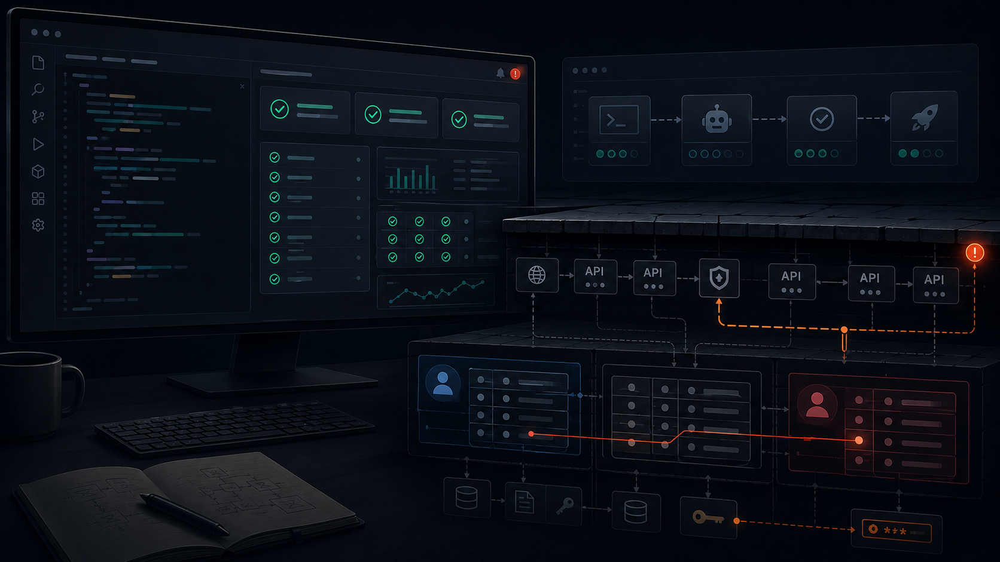

*Andrej Karpathy* coined "[vibe coding](https://x.com/karpathy/status/1886192184808149383)" in February 2025.  He later reframed the broader shift as ["agentic engineering" inside *Software 3.0*](https://analyticsdrift.com/andrej-karpathy-agentic-engineering-software-3/).  That framing made the question feel like a referendum on identity.  Are you a coder, or aren't you?

That's the wrong axis to optimize around.  AI has made code generation cheap.  It hasn't made failure understanding cheap.  The question isn't whether you can code.  It's whether you know what failure looks like.

The Linux Foundation's [2026 European tech talent data](https://www.linuxfoundation.org/blog/who-will-be-the-senior-engineers-of-2036) asks who will be the senior engineers of 2036, given that AI is absorbing the entry-level work that used to grow them.  That's the right long-term question.  The more immediate one is what the builder shipping software today already needs to know.

## The scarce skill is **failure literacy**

A [developer study on AI coding workflows](https://arxiv.org/pdf/2512.14012) didn't compare developers with non-developers.  It studied experienced developers, through field observations and surveys, and found that they use control strategies around AI output: planning, supervision, decomposition, validation, and review.  The paper is evidence for what experienced developers do when AI writes code, not for what non-developers fail to do.

What are those controls really doing?  They're forcing the model's output through a set of remembered failure cases.  A developer has seen an API return another customer's data because a query used `id` but not `owner_id`.  They've seen a background job mutate records it should only read.  They've watched a secret end up in browser-visible JavaScript, and each incident left behind a check.

*Addy Osmani*, Chrome's engineering director, [describes the model behavior](https://addyosmani.com/blog/ai-coding-workflow/) directly: an AI pair programmer can write code with conviction, even when the code is buggy or nonsensical.  A senior developer doesn't treat confidence as evidence.  They ask what the code forgot, what path the test never exercised, and what assumption the generated implementation quietly made.

**The missing skill isn't syntax.  It's failure literacy: the ability to name the ways a system can fail before users discover them.**  If a builder can't name the failure modes, the model won't reliably protect them from those failures.

## What the incidents actually show

The recent incidents don't reduce to one pattern.  They show two classes of failure: secrets exposure and authorization gaps.  Both are old software problems.  Missing *row-level security*, exposed keys, and broken authorization all predate LLMs.  AI made these failures faster to produce and easier for new builders to deploy.

[Moltbook](https://www.wiz.io/blog/exposed-moltbook-database-reveals-millions-of-api-keys) was a secrets exposure failure.  *Wiz* found 1.5 million API keys and 35,000 email addresses exposed to unauthenticated read and write access, the result of a client-accessible database path with access controls that didn't match the sensitivity of the data behind it.  The core question wasn't whether the login screen looked real.  It was whether the server-side access rules protected what the client-side code could reach.

[Lovable's CVE-2025-48757](https://thenextweb.com/news/lovable-vibe-coding-security-crisis-exposed) was an authorization and database policy failure.  The vulnerability allowed unauthenticated attackers to read or write arbitrary database table rows in generated projects with missing or misconfigured *RLS* policies.  *SentinelOne* disclosed publicly in May 2025, roughly two months after discovery.  The [technical writeup](https://mattpalmer.io/posts/CVE-2025-48757/) describes modified HTTP requests to *PostgREST* endpoints.  *Lovable* disputed the classification, arguing customers are responsible for configuring their own RLS policies.  If that holds, the gap is exactly the one this post is about: a builder who can't validate access controls can't know whether their app is safe.

*Escape* scanned [5,600+ publicly reachable apps](https://escape.tech/blog/methodology-how-we-discovered-vulnerabilities-apps-built-with-vibe-coding/) built with vibe coding tools and found 2,000+ vulnerabilities and 400+ exposed secrets.  The methodology leaned on passive scanning of reachable apps, not private review.  Still, the operational question is the same: what did the builder know to check before exposing the app to the internet?

**AI didn't invent these bugs.  It removed the friction from generating and deploying them.**  The happy-path test passes because it never tries another user's ID, never inspects the browser bundle for secrets, and never sends a modified request directly to the API.

## Domain experts can win, within limits

If the gap is failure literacy, then domain expertise is real leverage.  A lawyer knows what a fake citation looks like.  An accountant knows where reconciliation breaks at month end.  A clinician knows when a diagnostic code doesn't match the patient record.  Those aren't syntax skills.  They are validation skills.

[Anthropic's study of about 400,000 *Claude Code* sessions](https://www.anthropic.com/research/claude-code-expertise) found that domain experts such as lawyers, managers, and scientists performed within 5 to 7 percentage points of software engineers on classifier-derived success for code-producing sessions (29% vs. 34%).  The caveat matters: the study classified success from transcripts and couldn't measure real-world outcomes after deployment.

What does that suggest, not prove?  Domain experts can be strong AI builders when the task's correctness depends on domain judgment they actually apply.  A lawyer who verifies citations is using the right failure library, especially when [*Stanford HAI* found hallucination rates of 58% to 82% on legal queries](https://hai.stanford.edu/news/ai-trial-legal-models-hallucinate-1-out-6-or-more-benchmarking-queries).  A clinician reviewing an AI-suggested diagnostic code is doing the work missing from cases where [AI-generated codes appeared in electronic health records without clinical basis](https://www.wlbt.com/2025/07/25/doctors-noticing-ai-code-errors-records/).

**Domain expertise validates domain outputs.  It doesn't validate software security by proxy.**  A lawyer may catch a hallucinated case citation and still miss a broken authorization rule on a *Supabase* table.  For multi-user software, domain knowledge covers one failure class.  Everyone needs a minimum technical floor for the other.

## The confidence problem

This isn't only a miscalibration problem for newcomers.  *Anthropic's* [research on agent autonomy](https://www.anthropic.com/research/measuring-agent-autonomy) found that high-volume *Claude Code* users auto-approve more of the agent's actions than newcomers and interrupt it more often.  The people who've used the tool longest are still actively discovering [which checkpoints are load-bearing](/posts/which-human-checkpoints-to-delete).

Even experienced developers misread the effect of AI on their work more broadly.  *METR* ran a [randomized controlled trial](https://metr.org/blog/2025-07-10-early-2025-ai-experienced-os-dev-study/) with 16 experienced open-source developers on mature repositories, using early-2025 models.  The developers were 19% slower with AI while believing they were 20% faster.  *METR* later flagged the result as historically bounded: by early 2026, those findings were already out of date, and newer data had become harder to interpret as experienced developers increasingly self-selected out of no-AI conditions.  The durable finding isn't the speed number.  It's that even skilled practitioners can be badly miscalibrated when the tool feels productive, a gap that [compounds sharply at scale](/posts/ai-productivity-dip-longer-deeper-diverging).

What happens when the builder has no baseline?  If you've never built the same feature without AI, how would you know whether the generated design is simple or brittle, complete or partial, safe or merely plausible?

The security data has the same shape.  The [*Snyk* report](https://cloudwars.com/cybersecurity/snyks-ai-code-security-report-reveals-software-developers-false-sense-of-security/) found 75% of developers believe AI-generated code is more secure than human-written code, while 56% of those same developers also say AI frequently introduces security issues.  That contradiction is an instrumentation failure, not a moral one.

**When confidence rises faster than validation, the builder is flying without reliable instruments.**  The question is how to add instruments before the app has real users.

## The minimum floor before shipping

For a personal prototype, the bar can be low.  For software serving other people, especially anything with accounts, payments, private records, uploads, or generated decisions, the bar changes.

Before shipping a multi-user AI-built app, verify at least this.

- Are secrets out of the client bundle and the repo?
- Does every database table with user data have *RLS* or equivalent server-side access control?
- Does every CRUD operation check both authn and authz?
- Can User A fetch, modify, export, or infer User B's records by changing an ID, URL, request body, or filter?
- Are privileged operations enforced on the server rather than hidden in the interface?
- Do tests include cross-user access attempts, not just happy-path flows?
- Has someone with security experience reviewed the data model, generated policies, and API routes before it ships?

For domain logic, a second set of questions.

- What would a wrong result look like in the domain?
- Who is qualified to review it?
- What edge cases would be expensive, illegal, unsafe, or embarrassing if missed?
- What evidence would prove the output is correct enough to use?

**The skill is the ability to turn those questions into checks before the model's confidence becomes your confidence.**  Non-coders can build useful software with AI.  But real users deserve more than a working demo: a builder who knows what failure looks like, or someone brought in who does.

Before you ship, can you name the failures you are testing for?
