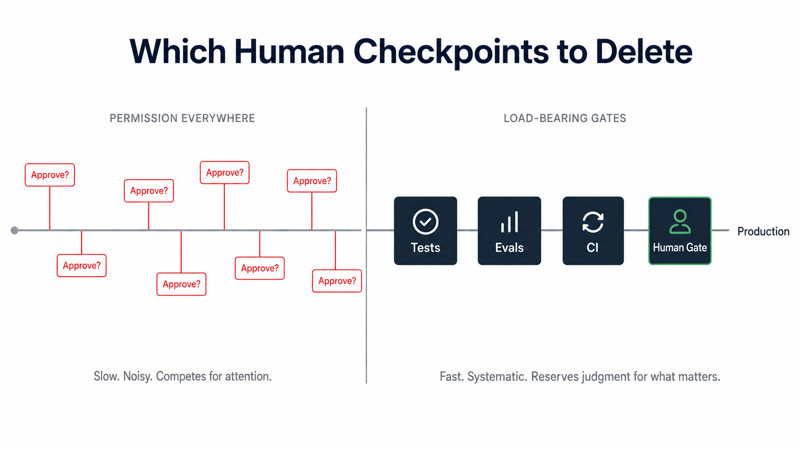

I used to think getting better at agents meant the agent needed me less.  Watch less, trust more, walk away while it works.  That turned out to be backwards.

Anthropic measured what experienced operators actually do.  In its [research on agent autonomy](https://www.anthropic.com/research/measuring-agent-autonomy), users with more than 750 Claude Code sessions auto-approve a larger share of the agent's actions than newcomers, above 40 percent against roughly 20, and they interrupt the agent more often, 9 percent against 5.  In the comparison, both rates are higher for high-volume users.  **The people who auto-approve more are also the people who stop it the most.**

That is the whole thing worth explaining: not a contradiction, but a clue.

Most of the conversation about working with agents sorts everyone onto one slider, from babysit-every-step at one end to accept-all-and-pray at the other.  Karpathy's ["vibe coding"](https://en.wikipedia.org/wiki/Vibe_coding) label named one pole: delegate heavily, stay loose, stop reading the diff.  The operator that practitioners keep describing as minding ["a toddler that needs to be overseen"](https://fortune.com/2026/02/23/always-on-ai-agents-openclaw-claude-promise-work-while-sleeping-reality-problems-oversight-guardrails/) sits at the other.  The slider is intuitive and it is wrong, because it cannot explain a person who does more of both ends at once.

**The variable that actually moves is not how much you control.  It is where your control lives.** There are three places it can live.  Most operators recognize the climb through them, even though a mature workflow still mixes all three depending on what is at stake.

*On the keyboard.* You are the runtime.  The agent proposes, you approve, line by line, because nothing else can catch a mistake before it lands.  This is the babysitter, and it is most people, including past-me.  It feels responsible and it does not scale past one agent and a short attention span.  Every gate here is manual, which means every gate competes for the same scarce resource: your attention in the moment.

*In the spec.* You stop hovering and start front-loading.  Detailed prompts, a written plan, acceptance criteria, then you launch and hope.  Harper Reed calls the spec ["the godhead"](https://harper.blog/2025/04/17/an-llm-codegen-heros-journey/), and among working engineers this is the most documented expert pattern there is.  The vibe coder is the same posture with the planning deleted instead of the supervision: one prompt, accept all, find out later.  Either way the spec is necessary and not sufficient.  It defines intent.  It does not enforce it.

*In the harness.* The checkpoints stop being things you do and become things your system does.  Tests gate routine changes.  Evals gate behavioral regressions against known failure cases.  CI turns both into something the agent cannot talk its way around.  Anthropic's engineering team [describes an eval](https://www.anthropic.com/engineering/demystifying-evals-for-ai-agents) in the most useful way: an automated test for an AI system, where the agent gets an input and grading logic decides whether the behavior was good enough.  Stop asking the operator to remember every failure mode in real time; put the known failure modes where the system has to pass through them.  A human-approval step guards the one or two actions you genuinely cannot take back, and everything else runs unattended.  Some checks move into the agent itself: uncertainty, missing authority, or destructive scope become reasons to pause and ask, not reasons to make a heroic guess.

This is the distinction that makes the Anthropic numbers stop looking paradoxical.  The study measures behavior inside Claude Code, not the full harness around it, but the shape is the same.  Those operators are not doing less oversight.  They have moved it off permission-clicking and onto interruption, redirection, and a few high-leverage gates.

None of this makes the agent safe by magic.  It makes the safety claim inspectable.  A weak eval is a permission slip with nicer formatting, and the point was never to replace judgment with tests.  It is to reserve judgment for the failures the tests cannot see.

I built this out in [*EdgePlane*](https://github.com/RyanMerlin/edgeplane), the agent orchestration layer I am shipping.  Every merge runs through nextest, Clippy with `-D warnings`, and a cargo audit pass, and the agent cannot talk its way around any of them.  In this workflow, the remaining hard gate is the merge to main that triggers the container build and the production deploy.  Everything up to that boundary runs unattended, and in practice it is the only gate I have found to be load-bearing so far.

The move from the keyboard to the harness is not adding oversight, and it is not removing it.  It is relocating it, then deleting what relocation made redundant.  The immature workflow approves every file edit and then lets the architecture run wild.  The mature one auto-approves routine edits because tests catch the regressions you have taught them to catch, then gates the architecture because nothing else will.  Same operator, more trust and more intervention, aimed at different layers.

Which means the skill that separates the clean pipeline from the one drowning in approval prompts is subtraction.  Ask it of every checkpoint you keep: is this load-bearing, or is it scar tissue from an incident back before you had the test that would catch it anyway? **Many manual gates are scar tissue, rational the day they were added and redundant since the day you wrote the eval.** The load-bearing ones sit closer to authority, blast radius, and irreversibility than to syntax.

Do the audit.  List every point where you stop and check the agent by hand, and for each one name what would actually break if you deleted it.

| Manual checkpoint | Better home | Safe to delete once |
|---|---|---|
| Approve every file edit | tests, typecheck, lint | regressions are caught before merge |
| Read every diff line | focused architectural review | tests cover behavior and blast radius is small |
| Approve each command | sandbox, allowlist, dry-run | the command is scoped and reversible |
| Approve publish, send, delete | keep the human gate | never; the action is irreversible or customer-visible |

Move the gates that survive into the harness as code, and delete the rest.

The tell that you are getting good at this is not that you watch less.  It is that the few times you reach for the keyboard, it matters.
